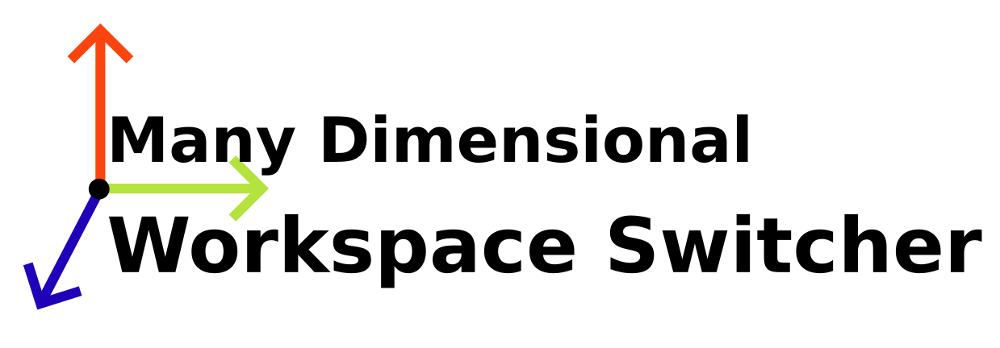

# Many Dimensional Workspace Switcher for Hyprland



arrange hyprland desktops into a many dimensional arrangement.
features include:
- GUI to switch desktops easily
- CLI to easily implement keyboard shortcuts
- arrange in 2d grid up to 24d space

## Requirements
- Qt 6

## Installation
1. download from [releases](https://github.com/Sammy-The-Fish/4dDesktopSwitcher/releases)
2. run `chmod +x ./ManyDimensionalDesktopSwitcher`
3. then run `./ManyDimensionalDesktopSwitcher` to launch UI

## Usage
to run the app using the GUI, run without arguments:
```shell
./ManyDimensionalDesktopSwitcher
```
to reset the program (reccomended to do on startup),
changes the amount of dimensions to `x`:
```shell
./ManyDimensionalDesktopSwitcher -R x
```
to change dimension of index: `i`, by delta `d` use:
```shell
./ManyDimensionalDesktopSwitcher -C i d
```

